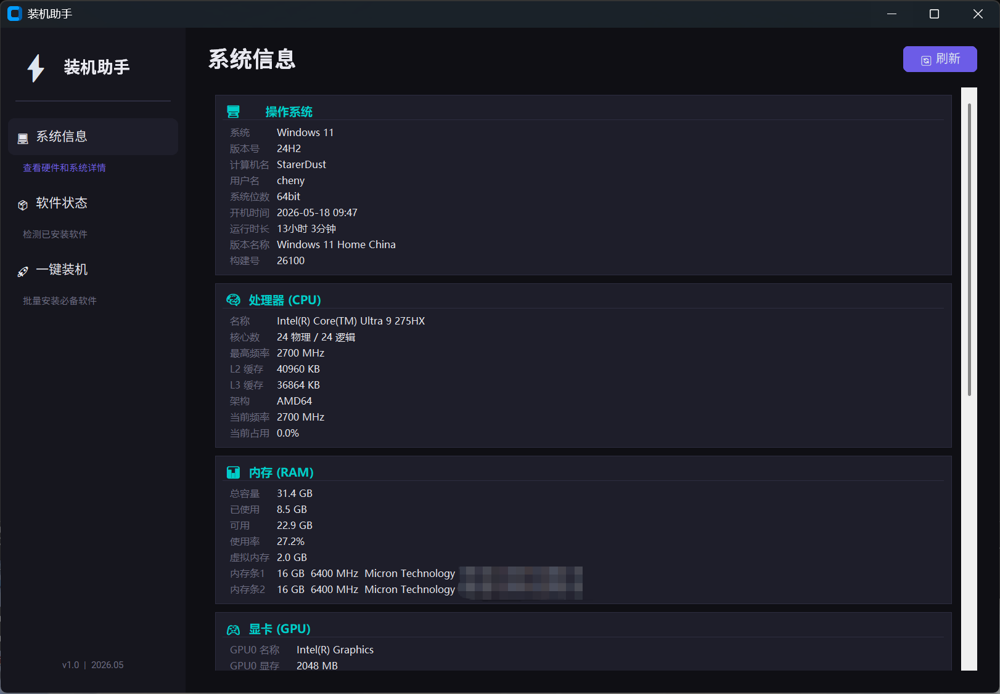

# 装机助手

一键检测硬件信息、软件激活状态、批量安装必备软件的桌面工具。



## 功能

- 硬件信息检测（CPU、内存、显卡、硬盘、主板、显示器、网络）
- 显示器刷新率检测
- Windows 激活状态检测
- 自动识别 Windows 11（构建号 >= 22000）
- 软件安装状态检测
- 一键批量安装常用软件（基于 winget）
- 暗色主题卡片式 UI

## 运行

```bash
pip install customtkinter psutil wmi pywin32
python setup_assistant.py
```

## 打包

```bash
pip install pyinstaller
python -m PyInstaller --onefile --windowed --name "装机助手" setup_assistant.py
```
